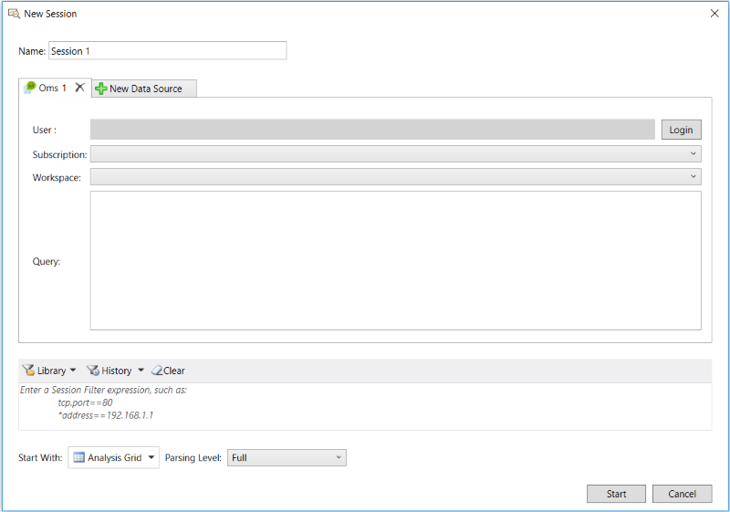

# Loading OMS Log Data

Message Analyzer now enables you to load data from Operations Management Suite (OMS) logs so that you can take advantage of Message Analyzer data viewers and analysis capabilities. Message Analyzer provides a search  interface to OMS  Log Analytics that you can access with the **OMS** data source feature of the **New Session** dialog during Data Retrieval Session configuration. However, **OMS** is a preview feature and for it to appear as an input data source in the **New Session** dialog, you will need to select the **OMS Import** feature on the **Features** tab of the **Options** dialog and then restart Message Analyzer. The **Options** dialog is accessible from the global Message Analyzer **Tools** menu.  
  
## OMS Background Information  

 The data and resources that are managed by OMS are organized by an OMS Workspace, which you can think of as  a unique OMS environment with its own data repositories and data sources. To access OMS data, you must have an Azure Subscription and credentials to log in to Azure.  You can have multiple Workspaces in your Subscription to support multiple environments, for example, production and test. In a Workspace, you can enable different solutions that return operational data, for example, the Wire Data solution, which returns Network and performance data. You can now use Message Analyzer to extract OMS data from logs that are written by solutions that are enabled in a Workspace that you create. Message Analyzer does this by creating an interface for the search component of OMS Log Analytics, which enables you to write Azure Resource Manager (ARM) queries that access specific data for which you are searching in a particular OMS data collection in your Workspace.  
  
 For a single query, a user might access several log entries of different types in a single workspace, while the number of log entries actually returned by OMS depends on the query itself. For example, if you write an ARM query such as "events &#124; top 100", you will return the first 100 events. If you specify a query such as "error", you will return all the log entries in your Workspace that contain errors.  
  
---  
  
 **More Information**   
 **To learn more** about Log Analytics search syntax, see the [Log Analytics Documentation](https://technet.microsoft.com/library/mt484087.aspx) topic on  TechNet.  

---  
  
## OMS Import Feature Process Flow  

 The processes that must occur in sequence to enable you to access data from OMS and display it in Message Analyzer consist of the following:  
  
-   A user **Login** provides the credentials that initiate the process of logging into Azure.  
  
-   The **Oms** tab of the **New Session** dialog displays a  **Subscription** and one or more **Workspaces** in corresponding drop-down lists.  
  
-   The user selects his/her **Subscription** and a **Workspace** under that **Subscription**.  
  
-   The user specifies an ARM search query in the **Query** text box on the **Oms** tab.  
  
-   The user clicks **Start** to exit the **New Session** dialog, at which time Message Analyzer uses the token returned by the **Login** process to facilitate sending an ARM query to OMS.  
  
-   OMS returns  one or more Java Script Object Notation (JSON) data structures to Message Analyzer for any log entry data that matches the input query.  
  
-   Message Analyzer parses the JSON and displays the data as individual messages, typically in the **Analysis Grid** viewer.  
  
### Using the Message Analyzer OMS User Interface  

 The interface for retrieving OMS log data is shown in the following figure.  
  
   
  
 **Figure 38: OMS log data retrieval interface**  
  
 When you are ready to load data from OMS into Message Analyzer, perform the steps that follow while referring to the preceding figure for location of features.  
  
1.  From the **Start** menu, **Start** page, or task bar of your computer, click the **Microsoft Message Analyzer** application to launch Message Analyzer. To ensure that you have access to all features, run Message Analyzer as an Administrator by right-clicking the Message Analyzer application and selecting **Run as administrator** from the context menu that appears.  
  
2.  Ensure that the **OMS Import** feature is enabled in the **Options** dialog, which is accessible from the global Message Analyzer **Tools** menu.  
  
     If the **OMS Import** feature is not enabled in the **Options** dialog, select the **OMS Import** check box and then restart Message Analyzer, as indicated earlier.  
  
3.  Click the **New Session** button on the global Message Analyzer toolbar to display the **New Session** dialog. The **Oms** button should appear under **Add Data Source** in the dialog.  
  
4.  Click the **Oms** button to display the **Oms** tab in the **New Session** dialog.  
  
5.  Click the **Login** button to specify your Azure account credentials and log in to Azure.  
  
6.  Click the **Subscription** drop-down and select your Azure Subscription in the list.  
  
7.  Click the **Workspace** drop-down and select an OMS Workspace in the list.  
  
8.  In the **Query** text box, write an ARM query for the data you want to retrieve.  
  
9. In the **Start With** drop-down list, select the **Analysis Grid** viewer, if it is not already selected.  
  
10. Click the **Start** button in the **New Session** dialog to begin data retrieval.  
  
11. Observe that Message Analyzer displays the data requested by your query in the **Analysis Grid** viewer as individual messages.  
  
---  
  
 **More Information**   
 **To learn more** about JSON, see the [JSON Official Site](http://json.org/).  
 
---