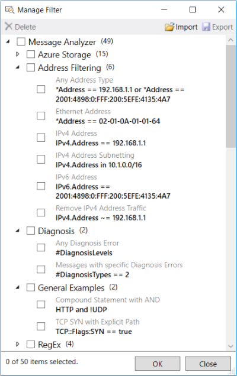
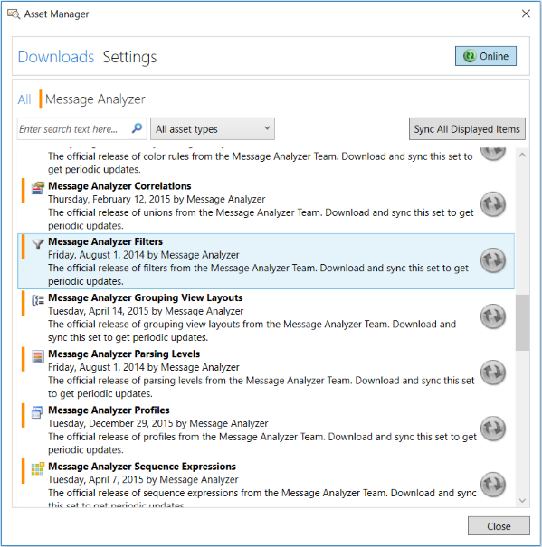

# Managing Session Filters
**Session Filter** management features enable you to create, modify, delete, import, export, and share filters. These same management features apply to all Message Analyzer asset collections that you typically work with, such as **Color Rules**, view **Filters**, viewer **Layouts**, **Viewpoints**, **Trace Scenarios**, **Chart View Layouts**, **Pattern Expressions**, and so on.  
  
## Using the Edit Filter Dialog  
 When you are configuring a Live Trace Session, you have the option to select or create a **Session Filter**, as described in [Working with Session Filters in a Live Trace Session](working-with-session-filters-in-a-live-trace-session.md). To create and save a new Filter Expression that you can use as a **Session Filter** or view **Filter**, you must open the **Edit Filter** dialog by selecting the **New Filter** item from the **Library** drop-down list above the **Session Filter** text box in the **New Session** dialog. In a similar manner, you can also access the **Edit Filter** dialog from the **Library** in any Filter panel that displays on the Message Analyzer Filtering toolbar during an  Analysis Session to create a new Filter Expression. However, you can also create a **Session Filter** from the **Manage Filter** dialog by modifying a copy of an existing Filter Expression; the **Manage Filters** dialog is accessible by clicking the **Manage Filters** item in the **Library** drop-down list in either of the indicated locations. In either case, you end up displaying the same **Edit Filter** dialog; the only difference is in how you get there. The **Edit Filter** dialog is shown in the figure that follows:  
  
   
  
 **Figure 25: Edit Filter dialog**  
  
 For example, when you select the **New Filter** item in the view **Filter** or **Session Filter** locations of the central Filter Expression **Library**, the **Edit Filter** dialog immediately displays and enables you to create and save a new Filter Expression. But when you select the **Manage Filters** item in either **Library** drop-down list, the **Manage Filter** dialog displays first; you can then create a new Filter Expression by right-clicking any of the built-in filter items in the **Manage Filter** dialog and selecting the **Create a Copy** command in the context menu that appears. Thereafter, the **Edit Filter** dialog displays from where you can modify the filter configuration, rename it, and save it back to the centralized Filter Expression **Library** as a new filter. Note that the **Edit** command is available for any Filter Expression that you right-click  in the **My Items** category of the **Manage Filter** dialog, that is, if  you want to modify one of your own custom-designed filters. Otherwise, you cannot edit any of the built-in Filter Expressions.  
  
 After configuring a new **Session Filter**, you can then select it during Live Trace Session or Data Retrieval Session configuration. You will also be able to select your new filter from the **Library** drop-down list on the Message Analyzer Filtering toolbar during an Analysis Session, but in this case, it will function as a view **Filter** only.  
  
> [!NOTE]
>  Creating Filter Expressions from the **Manage Filter** dialog for a Live Trace Session is only one use of this feature, as the dialog has additional management features that are briefly described in the remainder of this section.  
  
## Centrally Managing Filters  
 The **Library** in which **Session Filters** are contained is a local, centralized Filter Expression **Library** that is populated by the **Message Analyzer Filters** asset collection, which is accessible from the **Asset Manager** dialog. You can manage the Filter Expressions from this collection in your user **Library** by using the **Manage Filter** dialog. Because Filter Expressions are contained in a single central **Library**, you can not only centrally manage the **Library**, but you can also use any Filter Expression that is contained in the central **Library** as a **Session Filter** when configuring a Live Trace Session or a Data Retrieval Session, or as a view **Filter** during a data Analysis Session. You can manage the **Library** from either the toolbar above the **Session Filter** text box of the **New Session** (or **Edit Session**) dialog, or from the Message Analyzer Filtering toolbar that appears in every Analysis Session. In both cases, you access the **Manage Filter** dialog by selecting the **Manage Filters** item from the **Library** drop-down list in these locations. The **Manage Filter** dialog is shown in the figure that follows:  
  
   
  
 **Figure 26: Manage Filter dialog**  
  
 Message Analyzer uses the same management dialog format to manage all user Library types; the only difference is the varying types of assets that you manage, for example **Color Rules**, **Filters**, **Trace Scenarios**, **Viewpoints**, viewer **Layouts**, **Pattern Expressions**, **Chart Viewer Layouts**, and so on. Therefore, in this Operating Guide, the management dialog is occasionally referred to generically  as the **Manage \<AssetType>** dialog. From the **Manage \<AssetType>** dialog, you can import specific items; or export, delete, and modify selected items such as Filter Expressions; as described in [Managing User Libraries](managing-user-libraries.md).  
  
## Sharing Filter Items  
 The centralized Filter Expression **Library** items are shareable, as are items from other Message Analyzer asset collections. Message Analyzer provides a simple way to expose the Filter Expressions contained in this **Library** to others for sharing, or to retrieve Filter Expressions that others have shared.  
  
 To share Filter Expression items directly with others, you can use the **Export** feature in the **Manage Filter** dialog to save one or more Filter Expression items to a designated file share or other location. In addition, you can use the **Import** feature in the same dialog to access Filter Expression items that have been shared by others at a designated location. When exporting Filter Expressions, you have the option to select specific items that you want to distribute to others, including any items that you have created or modified. When importing a Filter Expression asset collection, you can choose the items you want to retrieve.  
  
 You can also share your Filter Expression items through a user-configured feed in the Message Analyzer Sharing Infrastructure. You can create such a feed from the **Settings** tab of the Message Analyzer **Asset Manager** (accessible from the global Message Analyzer **Tools** menu), by clicking the **Add New Feed** button and specifying a feed name and directory location. Thereafter, you can use the **Export** feature of the **Manage Filter** dialog to post your Filter Expression items as an asset collection to the configured feed location. You can also update an existing asset collection and make it available to team members or other users through your configured feed, where they can view, synchronize, and download the collection. However, for users to synchronize with collection updates, some manual configuration is necessary in the current Message Analyzer release, as described in [Manual Item Update Synchronization](manual-item-update-synchronization.md). In future Message Analyzer releases, the Sharing Infrastructure publishing features may automatically enable others to synchronize with asset collection updates when they are shared through user feeds.  
  
## Accessing the Message Analyzer Filters Asset Collection  
 Microsoft provides a default **Message Analyzer** feed on the **Downloads** tab of the **Asset Manager** that enables you to download the **Message Analyzer Filters** asset collection once from a Microsoft web service and to synchronize with collection updates that are periodically pushed out by the service. To receive updates that will appear in the **Message Analyzer** category of the centralized Filter Expression **Library**, you must set the **Message Analyzer Filters** asset collection to the auto-sync state from the **Downloads** tab of the Message Analyzer **Asset Manager**, that is, if the collection is not already synced. At any time after setting the auto-sync state, you can perform a download of an auto-synced collection from the **Settings** tab of the **Asset Manager**. The **Message Analyzer Filters** asset collection is shown on the **Downloads** tab of the **Asset Manager** dialog  in the figure that follows:  
  
   
  
 **Figure 27: Asset Manager dialog**  
  
> [!NOTE]
>  If an automatic update to an auto-synced asset collection is pushed out by the web service to your Message Analyzer installation, the updates are automatically populated to your user **Library**, with no further action required.  
  
---  
  
 **More Information**   
 **To learn more** about the Message Analyzer Sharing Infrastructure, including how to share asset collections with others and to auto-sync asset collections for updates, see the [Managing Message Analyzer Assets](managing-message-analyzer-assets.md) section.   
**To learn more** about the common **Manage \<AssetType>** dialog, see [Managing User Libraries](managing-user-libraries.md).   
---