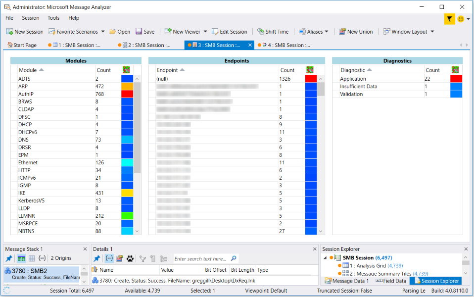

# Message Summary Lists Viewer
Message Analyzer provides the **Message Summary Lists** viewer, which is currently a preview feature. If you wish to use the **Message Summary Lists** viewer, you will need to select its check box on the **Features** tab of the **Options** dialog, which is accessible from the global **Tools** menu, and then restart Message Analyzer. It will then be available for selection in the **New Viewer** drop-down list on the global Message Analyzer toolbar.  
  
## Understanding the Message Summary Lists Viewer  
 Message Analyzer enables you to use the **Message Summary Lists** viewer to obtain statistics that reflect key data points across the time line of a set of trace results. These data points provide basic summary information about a trace at-a-glance, as shown in the figure that follows:  
  
   
  
 **Figure 49:  Message Summary Lists viewer**  
  
 **Viewing Statistical Summary Data**   
The statistics data that you can view is organized into three different categories and within each there are three sortable columns of data. The categories for the statistics data that you can observe with this viewer consist of the following:  
  
> [!NOTE]
>  This viewer does not interactively drive the display of data in any other data viewer or **Tool Window**.  
  
-   **Modules** — displays each **Module** that supported a message conversation, along with the total message **Count** for each **Module**, across the time line of a trace.  
  
-   **Endpoints** — the address of each **Endpoint** associated with a message conversation, along with the total message **Count** for each **Endpoint** conversation, across the time line of a trace.  
  
-   **Diagnostics** — the total **Count** of **DiagnosisType** messages detected in a set of trace results, which includes **Application**, **Validation**, **Insufficient Data**, and **Parsing** message types.  
  
     ___________________\_  
  
     **More Information**   
     **To learn more** about **Diagnosis** message types, see the [Diagnosis Category](filtering-live-trace-session-results.md#BKMK_DiagnosisEnums) topic.   
    ___________________\_  
  
 You can sort each column in any of the indicated categories to organize the data display differently, which includes sorting the heatmap column. The heatmap column in each category provides a color-coded visual representation of the message volume in each category, as indicated by the **Count** column. Higher volumes correspond with the red shades and lower volumes correspond with the blue shades.  
  
> [!TIP]
>  To isolate the data that is associated with any selected row of data in the **Modules**, **Endpoints**, or **Diagnostics** categories of the **Message Summary Lists** viewer, right-click a data row and select the **Open Selected Items** command in the context menu that appears. Message Analyzer will then open a new **Analysis Grid** viewer session tab to display the data associated with the row you selected, for further examination.  
  
## See Also  
 [Message Summary Tiles Viewer](message-summary-tiles-viewer.md)