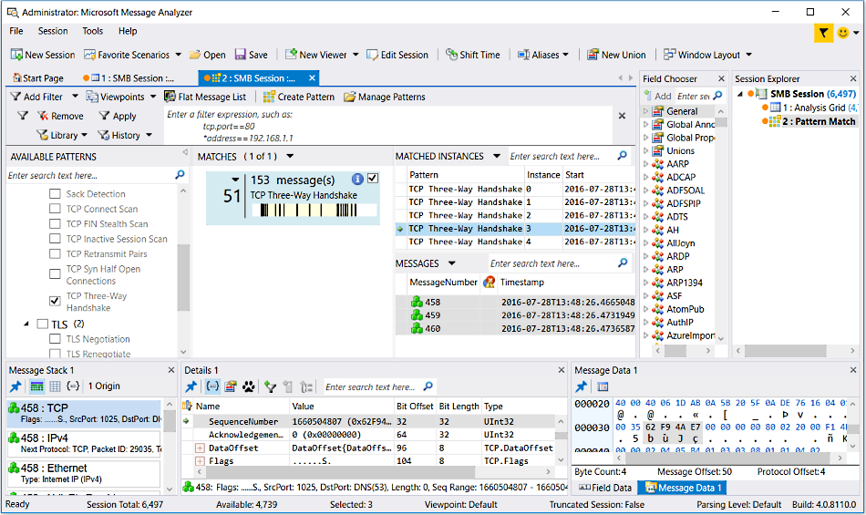

# Pattern Match Viewer

Filtering is an important technique for isolating messages in a trace that meet specific filtering criteria. However, because the application of filtering is restricted to the domain of *individual* message values, it cannot expose the context or “sequence” in which events occur across the entire timeline of a trace. To enable sequences or patterns of events to be detected, Message Analyzer provides a pattern matching capability that can identify sequential message patterns in a *group* of messages. This pattern detection process is carried out by a Message Analyzer pattern matching engine that provides a fast and easy way for you to isolate and evaluate sequential patterns in your data. Pattern matching is a unique addition to the arsenal of Message Analyzer tools that you can use to analyze your message data.  
  
## Using Pattern Matching  

 You can use **Pattern** matching as a unique mode of analysis for trace results. In the hypothetical examples that follow, the pattern matching engine would identify the matched instances of an executing pattern definition within a trace, and when complete, report the messages that contain those occurrences, along with any additional information specified by the OPN behavior scenario design, such as captured field or property values. For example, you could use **Pattern** matching to accomplish any of the following:  
  
-   Identify virus patterns.  
  
-   Discover processes in a faulty state that return a consistent message pattern or sequence.  
  
-   Create TCP troubleshooting scenarios.  
  
-   Identify the request-response message pattern that is typical of HTTP, SMB, LDAP, DNS, and other protocols.  
  
-   Discover interesting areas to target for troubleshooting, rather than finding the specific cause of a problem.  
  
## Invoking Pattern Matching  

 In Message Analyzer, you can utilize pattern matching functionality by invoking the **Pattern Match** viewer from the locations described in [Session Data Viewer Options](session-data-viewer-options.md). This includes specifying the **Pattern Match** viewer when starting a Data Retrieval Session, starting a Live Trace Session, or when opening it to assess trace results in an Analysis Session.  
  
 The figure that follows shows the results of executing the **TCP Three-Way Handshake** Pattern expression against a set of trace results. The **Pattern Match** viewer lists all the matches that were found in the **MATCHED INSTANCES** pane. In this pane, you will also find important statistics for TCP troubleshooting, such as TCP configuration settings that could expose potential TCP misconfiguration.  
  
   
  
 **Figure 43: Pattern Match Viewer**  
  
---  
  
 **What You Will Learn**   
In the following topics of this section, you will learn about matching message sequences by executing predefined **Pattern** expressions that are provided with the **Pattern Match** viewer. You will also learn about how to view matched instance data and how to create your own **Pattern** expressions:  
[Using the Pattern Match Viewer](using-the-pattern-match-viewer.md) — learn how to use the **Pattern Match** viewer to execute predefined **Pattern** expressions and how to assess the resulting set of matched instances.  
[Understanding Message Pattern Matching](understanding-message-pattern-matching.md) — study an OPN code walkthrough for two of the predefined TCP **Pattern** expressions. These examples are intended to help you learn about **Pattern** expression construction and functionality, so that you can create your own.  
[Using the Pattern Editor](using-the-pattern-editor.md) — learn about how to build your own **Pattern** expressions in OPN, with or without the assistance of user interface (UI) automation.  
[Managing Pattern Expressions](managing-pattern-expressions.md) — learn how to manage **Pattern** expressions, which includes importing and exporting **Pattern** expressions for mutual sharing with others on your team.  

---