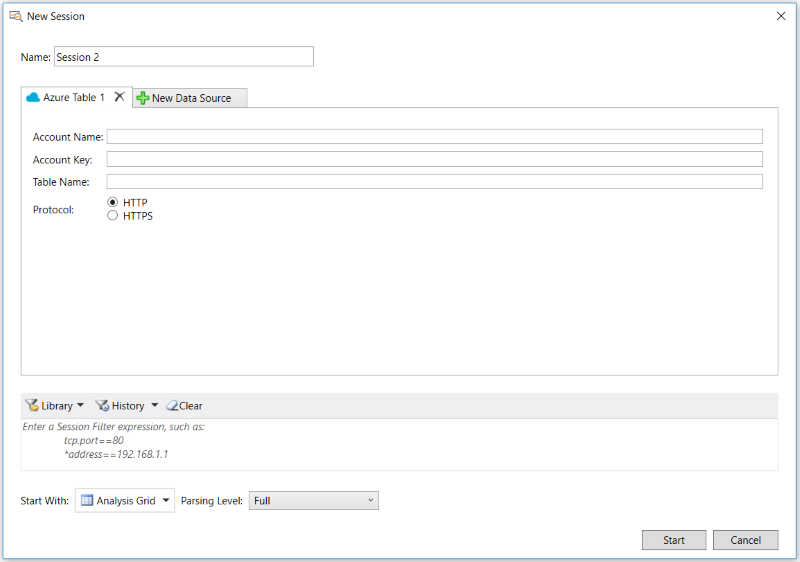

# Retrieving Azure Storage Table Data
Message Analyzer versions 1.2 and later provide a data input preview feature known as the **Azure Table Import**, which enables you to retrieve data stored in an Azure Storage table. To enable this feature, you will need to select it on the **Features** tab of the **Options** dialog, which is accessible from the global Message Analyzer **Tools** menu. After you click **OK** to exit the **Options** dialog, you must restart Message Analyzer so that the **Azure Table** button appears in the **New Session** dialog, from where you can select it.  
  
---  
  
 **Go To Procedure**   
To proceed directly to a detailed procedure that you can follow to retrieve Azure Storage table data, see [To access, load, and view data stored in an Azure table](procedures-using-the-data-retrieval-features.md#BKMK_LoadAzureTableData). Otherwise, you can review the [Workflow Overview](retrieving-azure-storage-table-data.md#BKMK_AzureWrkflowOverview).   
---  
  
## Specifying Connection Information  
 After you start a **New Session** from the Message Analyzer **File** menu and you click the **Azure Table** button, an input configuration appears on the **Azure Table** tab from where you can provide connection information. To enable Message Analyzer to read Azure Storage table data, you will need to obtain and enter the following required information:  
  
-   **Account Name** — an Azure Storage account name. You can obtain this information from your Azure portal.  
  
-   **Account Key** — an Azure Storage account access key. You can obtain this information from your Azure portal.  
  
-   **Table Name** — the name of the table that contains the data you want to access.  
  
 The figure that follows shows the **Azure Table** interface from where you provide the specified input information.  
  
   
  
 **Figure 33: Azure Table input configuration**  
  
   
## Workflow Overview  
 The following procedure outlines the general steps you can follow when configuring a Data Retrieval Session to load data from an Azure Storage table into Message Analyzer:  
  
1.  On the Message Analyzer **File** menu, point to **New Session** and then select **Azure Table** in the submenu to open a Data Retrieval Session that enables you to target Azure Storage table data as input to Message Analyzer.  
  
2.  Enter an **Account Name**, **Account Key**, and **Table Name** on the **Azure Table** tab of the **New Session** dialog.  
  
3.  Select either **HTTP** or **HTTPS** as the connection **Protocol**.  
  
4.  Ensure that the **Analysis Grid** viewer is selected in the **Start With** drop-down list.  
  
5.  Start retrieving data by clicking the **Start** button in the **New Session** dialog.  
  
6.  Observe that the Azure Storage table data displays in the **Analysis Grid** viewer, with the Azure table properties displaying as fields in the **Summary** column.  
  
7.  Optionally, expose other Azure table fields in the **Analysis Grid** viewer for enhanced analysis, by using the **Field Chooser** **Tool Window**.  
  
> [!NOTE]
>  By default, Message Analyzer displays Azure Storage table information as rows of message data with all the parsed properties displaying in the **Summary** column of the **Analysis Grid** viewer. Because Message Analyzer parses each property in an Azure Storage table and represents it as a field after loading the data, you can utilize the **Field Chooser** window to configure separate columns in the **Analysis Grid** viewer to contain the field data for any of the Azure table properties that are normally condensed into the **Summary** column. This can make it easier to review and work with the values of individual fields.  
  
 You can locate the Azure Storage table properties as fields in the **Field Chooser** window under the Azure storage table top-level node. If you expand that node, you should be able to identify the Azure table according to the **Table Name** that you entered earlier on the **Azure** tab of the **New Session** dialog. Under this node, you will find all the Azure table fields that you can add as columns to the **Analysis Grid** viewer.  
  
> [!TIP]
>  For analysis purposes, you can quickly create a view **Filter** based on the values of any field with the use of the **Add '\<fieldName>' to Filter** item in the context menu that displays when you right-click a field in the **Details** **Tool Window**, just as you can for any Live Trace Session that has completed. You can also do this for the  column entities in the **Analysis Grid** viewer. Filtering can isolate specific data that you might be looking for, which could be particularly useful when an Azure Storage table contains a high volume of data.  
  
---  
  
 **More Information**   
 **To learn more** about Message Analyzer session configuration, see [Starting a Message Analyzer Session](starting-a-message-analyzer-session.md).   
**To learn more** about **Session Filters**, see [Applying a Session Filter to a Data Retrieval Session](applying-a-session-filter-to-a-data-retrieval-session.md).  
**To learn more** about creating filter expressions, see [Writing Filter Expressions](writing-filter-expressions.md).  
**To learn more** about the **Field Chooser**, see the [Field Chooser Tool Window](field-chooser-tool-window.md) topic.  
---  
  
## See Also  
 [Retrieving Azure Storage Blob Data](retrieving-azure-storage-blob-data.md)