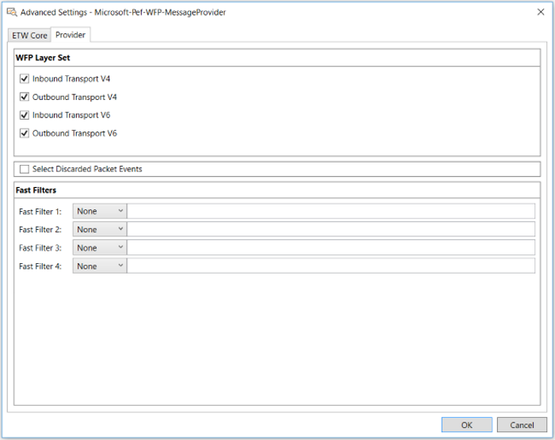

# Using the Advanced Settings- Microsoft-PEF-WFP-MessageProvider Dialog

This section describes the types of filters that you can configure for the **Microsoft-PEF-WFP-MessageProvider**. The filtering configurations are available from the **Advanced Settings** dialog for this provider, which displays after you click the **Configure** link to the right of the **Microsoft-PEF-WFP-MessageProvider** after it appears in the **ETW Providers** list of the **New Session** dialog during Live Trace Session configuration. The **New Session** dialog is accessible from the Message Analyzer **File** menu, the **Start Page**, or the global Message Analyzer toolbar.  
  
 You can add the **Microsoft-PEF-WFP-MessageProvider** to the **ETW Providers** list, by selecting any **Trace Scenario** that uses this provider from the **Select Scenario** drop-down list in the **New Session** dialog during Live Trace Session configuration. For example, you can select any of the following **Trace Scenarios** to display the **Microsoft-PEF-WFP-MessageProvider** in the **ETW Providers** list:  
  
-   **Loopback and Unencrypted IPSEC**  
  
-   **Local Loopback Network**  
  
-   **Network Tunnel Traffic and Unencrypted IPSEC**  
  
-   **SMB2 Client and Firewall**  
  
The **Advanced Settings** dialog for the **Microsoft-PEF-WFP-MessageProvider** is shown in the figure that follows:  
  
  
  
**Figure 23: Advanced Settings for the Microsoft-PEF-WFP-MessageProvider**  
  
## Using WFP Layer Set Filters  

 When configuring settings for the **Microsoft-PEF-WFP-MessageProvider** in **Trace Scenarios** that use it, you can create a **WFP Layer Set** filter configuration that directionally isolates inbound or outbound TCP packets at the Transport Layer for IPv4 or IPv6 traffic. A scenario where you might want to do this is when you are capturing loopback traffic, in which case, you should disable either inbound or outbound IPv4 and IPv6 traffic to avoid the duplication of messages. Otherwise, for regular network traffic, you should always enable both inbound and outbound packet directions.  
  
 You can specify the configuration for the **WFP Layer Set** filters on the **Provider** tab of the **Advanced Settings – Microsoft-PEF-WFP-MessageProvider** dialog.  The **WFP Layer Set** contains the following filters, which you can enable or disable, respectively, by selecting or unselecting the corresponding filter check boxes as appropriate:  
  
-   INBOUND_TRANSPORT_V4  
  
-   OUTBOUND_TRANSPORT_V4  
  
-   INBOUND_TRANSPORT_V6  
  
-   OUTBOUND_TRANSPORT_V6  
  
These check boxes represent kernel mode TCP/IP stack filters that operate in the receive or send path (inbound or outbound, respectively) at the Transport Layer before any processing occurs at this layer. When you create a **WFP Layer Set** configuration with these check boxes, you selectively enable or disable the kernel mode filters that pass or block inbound, outbound, or bidirectional packet traffic at the Transport Layer, depending on the settings, for IPv4 and IPv6 traffic.  
  
## Using WFP Fast Filters  

 The actual work that is performed by the **Fast Filters** that you specify in the **Microsoft-PEF-WFP-MessageProvider** configuration is accomplished by the WFP base filtering engine (BFE). The message frames that pass the filtering criteria are delivered to the **Microsoft-PEF-WFP-MessageProvider** callout drivers at the corresponding layers, which in turn send the messages to the enabling ETW session.  
  
 **WFP Fast Filters** consist of the following types:  
  
-   **IPv4** — enables you to filter live traffic based on a specified IPv4 address, as described in [IPv4Address Filters](ipv4address-filters.md).  
  
-   **IPv6** — enables you to filter live traffic based on a specified IPv6 address, as described in [IPv6Address Filters](ipv6address-filters.md).  
  
-   **TCP port** — enables you to filter live traffic based on a specified TCP port.  
  
-   **UDP port** — enables you to filter live traffic based on a specified UDP port.  
  
**Utilizing Fast Filter Relational Operators**   
When you configure **Fast Filters** in the **Advanced Settings - Microsoft-PEF-WFP-MessageProvider** dialog, you have the option to enhance filter functionality with the use of several relational operators, which includes the following:  
  
-   Logical NOT (!)  
  
-   GREATER THAN (>)  
  
-   LESS THAN (<)  
  
For example, you might apply **Fast Filter** configurations that exclude or include specific traffic on a **TCP port** or **UDP port**, respectively. To do this, you could configure one **Fast Filter** with a **TCP port** set to remove HTTPS traffic from your live trace and another **Fast Filter** with a **UDP port** set to exclude all traffic except LDAP messages, respectively, as follows:  
  
**Fast Filter 1** value for **TCP port**:  `!= 443`  
**Fast Filter 2** value for **UDP port**:  `== 389`  
  
## Logging Dropped Packets  

 The **Microsoft-PEF-WFP-MessageProvider** also enables you to log dropped packet information, which includes reason and layer statistics. To obtain these statistics, you must select the **Select Discarded Packet Events** check box on the **Provider** tab of the **Advanced Settings – Microsoft-PEF-WFP-MessageProvider** dialog.  
  
 Logged information for discarded packet events consists of dropped packet statistics that are derived from the Discard filter layer of the Statistics callout in the **Microsoft-PEF-WFP-MessageProvider**. Statistics consist of the reason for dropping packets and the layer on which they were dropped.  
  
 You can view the dropped packet statistics as ETW events in the **Analysis Grid** viewer after a  trace with the **Microsoft-PEF-WFP-MessageProvider** is complete. You can use the **Column Filter** feature for the **Summary** column of the **Analysis Grid** viewer to specify a search term such as "discard" to expose any messages that might indicate that the firewall was involved in blocking traffic. The **Discarded Packet Events** feature can help you troubleshoot whether packets are being dropped by the network, the **Microsoft-PEF-WFP-MessageProvider**, or the firewall.  
  
> [!NOTE]
>  When you select the **Select Discarded Packet Events** check box on the **Provider** tab of the **Advanced Settings** dialog, any **Fast Filters** or **WFP Layer Set** filters that you have specified will not be applied to the discarded packet events.  
  
---  
  
 **More Information**   
 **To learn more** about using **Column Filters**, see [Filtering Column Data](filtering-column-data.md).   

---  
  
## See Also  

[Microsoft-PEF-WFP-MessageProvider](microsoft-pef-wfp-messageprovider.md)