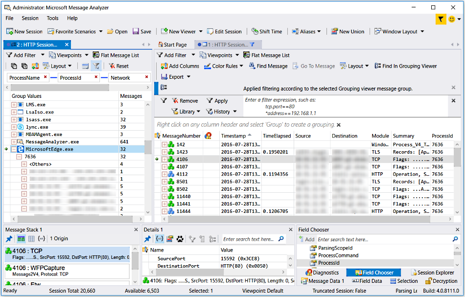

# Viewing Process Name Data
The capability to view process names in message data captured by any ETW trace provider is now native to Message Analyzer, although detection of process names  is currently not guaranteed for incoming messages. This means that you can add the **ProcessName** field (from the **Global Properties** node of **Field Chooser**) as a new **Analysis Grid** viewer column and view process name data across a set of trace results. If you also add a **Network** field column from the  **IPv4** node in **Field Chooser**, you can correlate the IP conversations with which the process names are associated. The input file types in which you can view process name data include .matp, .etl, .evtx, and .cap files.  
  
## Using the ProcessName Property  
 If you want to isolate the messages that were captured by Message Analyzer for each process, you can execute the **Group** command on the **ProcessName** column of the **Analysis Grid** viewer to separate the trace messages into groups of **ProcessName** nodes, where each node contains all the messages associated with a particular process name. You can create this grouped display configuration by right-clicking the **ProcessName** column header and then selecting the **Group** command. If you also added the **Network** field as a new **Analysis Grid** viewer column, as suggested earlier, you can similarly execute the **Group** command on this column to correlate the associated network conversations with process names.  
  
 Alternatively, you could simply display the **Process Name and Conversations** view **Layout** for the **Analysis Grid** from the **Layout** drop-down list on the **Analysis Grid** viewer toolbar to view similar data. However, note that this **Layout** also adds a **Transport** group that exposes the ports that carried the network conversations. In any case, the data can tell you very quickly which processes are consuming the most bandwidth and can also help you isolate any process (and supporting messages) that you may already suspect is causing a problem.  
  
 For incoming messages, Message Analyzer does not guarantee the display of process names. In this case, Message Analyzer should display the ETW **ProcessID** value in the **ProcessName** column of the **Analysis Grid** viewer.  
  
 **Layouts Containing the ProcessName Field**   
The **ProcessName** property is used in the following data viewer **Layouts**:  
  
-   **Grouping** viewer — uses the **ProcessName** and **ProcessId** properties in this **Layout**:  
  
    -   **Process Name and Conversations** — this **Layout** (left side of the user interface) simulates the **Network Conversation** tree in Microsoft Network Monitor, as shown in the figure that follows.  
  
           
  
         **Figure 64: Grouping Viewer ProcessName node selection driving the Analysis Grid viewer**  
  
-   **Analysis Grid** viewer — uses the **ProcessName** property in these **Layouts**:  
  
    -   **Process Name and Conversations**  
  
    -   **Network Monitor**  
  
    -   **Process View**  
  
## See Also  
 [Analysis Grid Viewer](analysis-grid-viewer.md)   
 [Grouping Viewer](grouping-viewer.md)   
 [Working With Message Analyzer Profiles](working-with-message-analyzer-profiles.md)